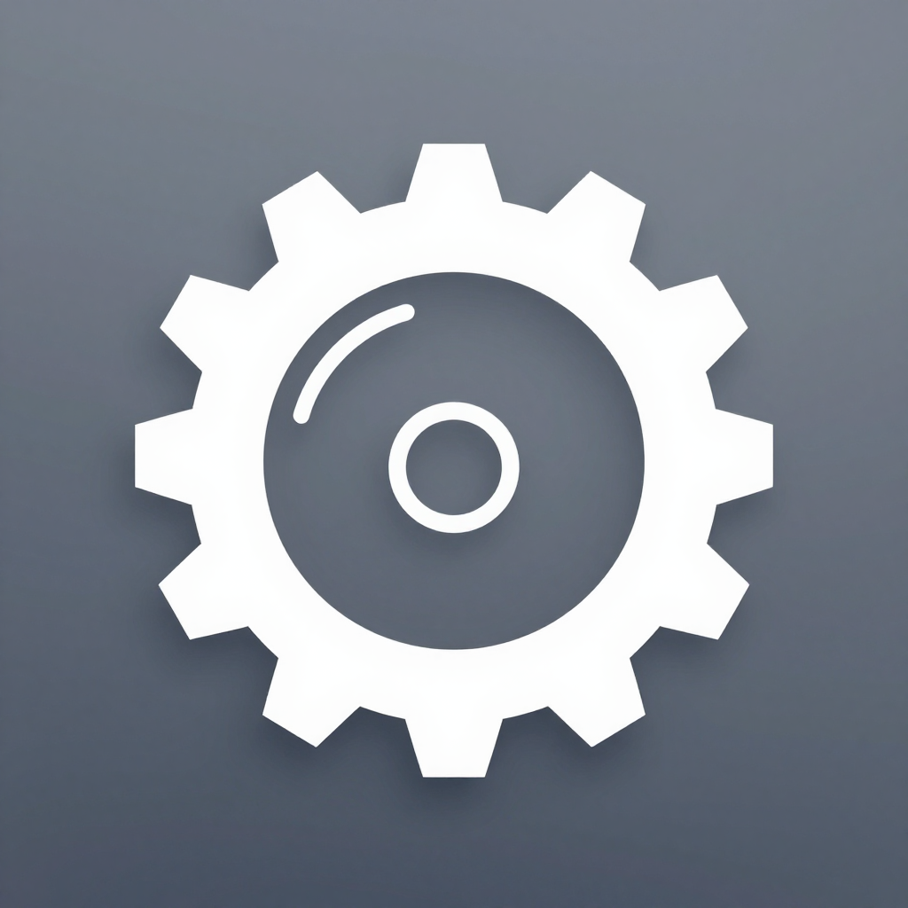

<div align="center">

<h2>DontCrack Desktop</h2>
<h3>DontCrack 统一管理桌面工具（Tauri 2 + Vue 3）</h3>
</div>

### 一、项目简介

- 基于 **Tauri 2 + Vue 3 + TypeScript** 的跨平台桌面客户端，作为 DontCrack 进程管理器的统一管理入口
- 统一管理 `DontCrack4Windows`、`DontCrack4ManyLinux`、`DontCrack4AndroidLinuxKernelSide`、`DontCrack4OpenHarmonyLinuxKernelSide` 四个平台的进程管理服务
- 直接复用 DontCrack 各平台共享的同一套 HTTP 接口（`/startup` / `/heartbeat` / `/shutdown`，默认端口 11883），无需在目标设备安装任何额外组件
- 通过 Rust 侧 `reqwest` 代理请求，天然规避浏览器 CORS 限制，桌面端直连局域网/本机 DontCrack 服务

### 二、功能特性

- **多实例管理**：同时维护多个 DontCrack 服务实例，按平台（Windows / Linux / Android / OpenHarmony）区分标识，本地持久化保存
- **进程监控**：轮询 `/heartbeat` 实时展示进程状态、PID、重启次数、文件类型、程序路径、启动参数、环境变量、最后退出时间
- **进程控制**：一键 `/startup` 启动进程（自动重置重启次数）、`/shutdown` 终止进程
- **日志查看**：实时展示 DontCrack 心跳接口返回的进程日志（区分 STDERR/STDOUT 着色）
- **可用性扫描**：一键扫描全部实例在线状态
- **密码鉴权**：支持配置 DontCrack 管理密码，请求自动携带 `password` 参数

### 三、开发环境

要求已安装 [Node.js](https://nodejs.org/)（18+）与 [Rust](https://www.rust-lang.org/)（1.77+），并安装 Tauri 平台依赖（见 [Tauri 官方文档](https://v2.tauri.app/start/prerequisites/)）。

```bash
# 安装依赖
npm install

# 启动开发模式（热更新 + Tauri 桌面窗口）
npm run tauri dev

# 类型检查 + 前端构建
npm run build

# 打包桌面安装包
npm run tauri build
```

### 四、使用说明

1. 启动应用后，在左侧「添加实例」区域填写：
   - **实例名称**：如 `边缘网关-01`，便于识别
   - **服务地址**：目标设备上 DontCrack 的 HTTP 地址，如 `http://192.168.1.100:11883`（不填端口默认 11883）
   - **管理密码**：与 DontCrack 启动参数 `-password` 一致（未开启密码保护可留空）
   - **平台类型**：Windows / Linux / Android / OpenHarmony，用于分组标识
2. 点击「添加实例」，再点击「刷新状态」即可查看该进程的管理器运行状态与日志
3. 使用「启动进程 / 停止进程」按钮控制目标进程；「扫描全部」可一次性探测所有实例的在线情况
4. 底部的「自动刷新」可开启/关闭轮询，调整 1s ~ 10s 的心跳刷新间隔

### 五、技术架构

- **前端**：Vue 3（Composition API）+ Vite 6 + TypeScript，数据持久化于 `localStorage`
- **桌面壳**：Tauri 2（Rust），通过 `tauri::command` 暴露 `dc_request` 代理接口
- **通信**：前端 `invoke('dc_request')` → Rust `reqwest` → DontCrack HTTP 接口，支持超时控制与 password 鉴权

### 六、开源协议

本项目采用 [Apache License 2.0](./LICENSE)。与 DontCrack 各平台版本保持一致的许可协议。